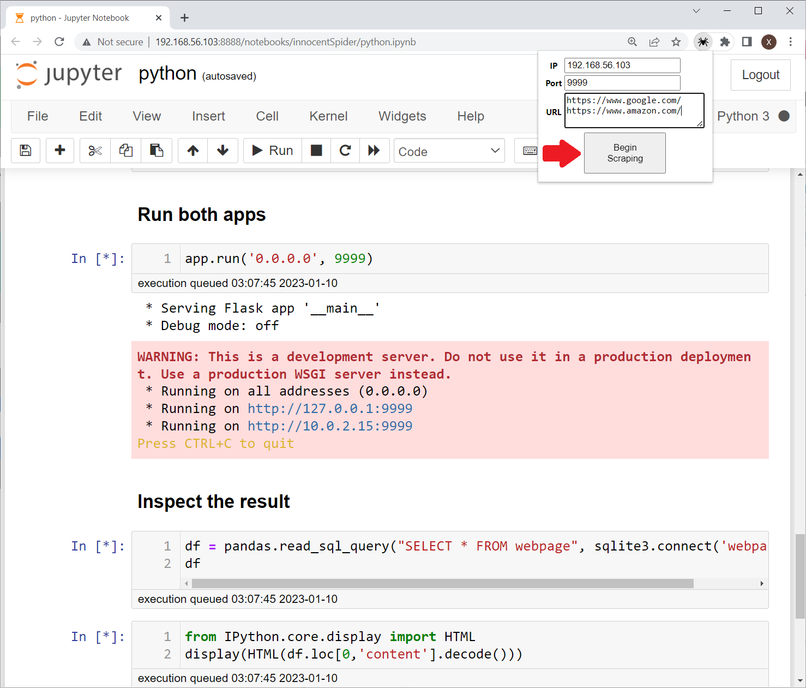

## innocentSpider: A Chrome Extension that
1. Get urls from a webserver. 
2. Open urls and extract DOMs. 
3. Send DOMs back to the webserver.
### An experimental webspider against the anti-bot solution  
Some website might require the execution of an anti-bot javascript to proceed, which blocks the traditional Python-based webspider since it is hard to handle the anti-bot javascript in Python environment. Selenium is also detectable by the anti-bot javascript. Maybe a self-made google extension can beat some anti-bot solutions.  
### Usage:  
1. Toggle Developer Mode in chrome://extensions/
2. Load innocentSpider\ChromeExtension folder
3. Run python.ipynb on a local machine. 
4. "Begin Scraping". 

### Updates
* 2023-01-10 Migrate from Manifest V2 to V3